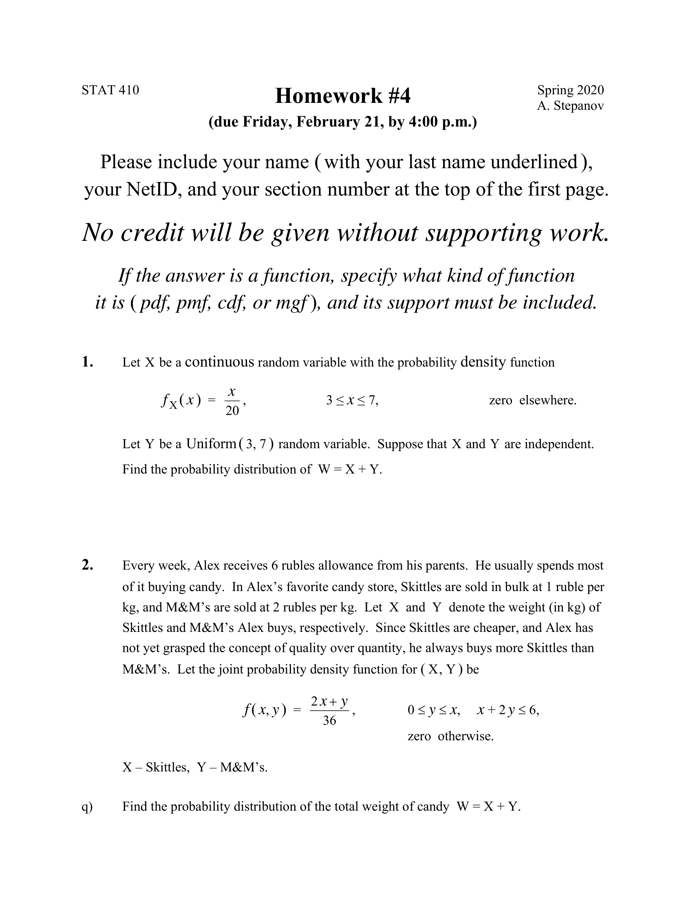

## A short bio

You can use the [editor on GitHub](https://github.com/tr898943/tr898943.github.io/edit/master/index.md) to maintain and preview the content for your website in Markdown files.

Whenever you commit to this repository, GitHub Pages will run [Jekyll](https://jekyllrb.com/) to rebuild the pages in your site, from the content in your Markdown files.

### Picture

Markdown is a lightweight and easy-to-use syntax for styling your writing. It includes conventions for

## Personal Info
- [resume](https://drive.google.com/file/d/1WBiG_2s8-1E7-n8sO5IaOmbS5o5MN6mC/view?usp=sharing)
- [Linkedin](https://www.linkedin.com/in/天宇-陈-a02b3a1a3)
- [Github](https://github.com/tr898943/)

## Blog

- [Stat 385 Project](Stat-385-Project.html)
- Stat 385 HW1
